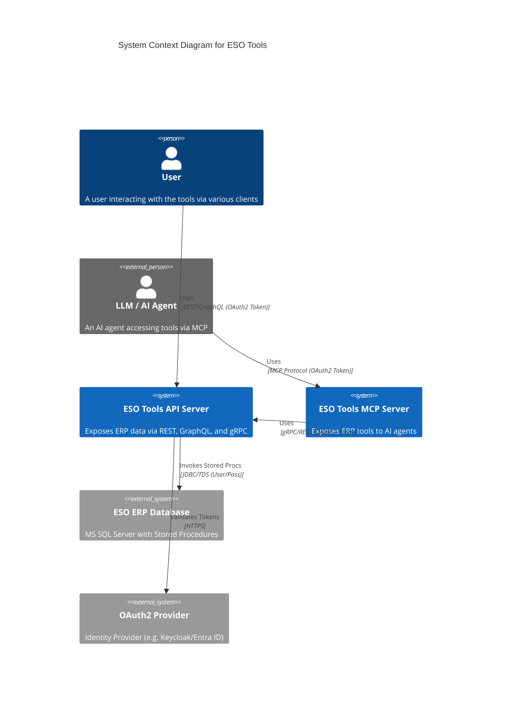

# Architecture: ESO Tools

## System Overview

The ESO Tools project aims to expose transactional data from the ESO ERP system (MS SQL Server) via multiple interfaces (REST, GraphQL, gRPC, and MCP). The system consists of two main deployable artifacts: an API Server and an MCP Server.

## Technology Stack

Based on `requirements.md` and `AGENTS.md`:

*   **Language**: Kotlin
*   **Web Framework**: Ktor
*   **Database Access**: JetBrains Exposed (SQL DSL)
*   **Database**: MS SQL Server (Existing ERP Database)
*   **Configuration**: HOCON (`application.conf`)
*   **Build Tool**: Gradle
*   **Testing**: Kotest, Wiremock
*   **Observability**: OpenTelemetry, Prometheus, slf4j

### Constraints
*   **NO Spring Framework**: Strictly forbidden by `requirements.md` and `AGENTS.md`.
*   **Stored Procedures Only**: The application must access data via Stored Procedures in the MS SQL database.

## Architectural Patterns

*   **Modular Monolith / Microservices Lite**: Two distinct services (API and MCP) to separate concerns.
*   **Adapter Pattern**: The API Server acts as an adapter for the legacy ERP Stored Procedures.
*   **Client-Server**: The MCP Server acts as a client to the API Server.

## System Diagrams

### C4 Context Diagram



### Container Diagram

```mermaid
C4Container
    title Container Diagram for ESO Tools

    Container(api_server, "API Server", "Kotlin, Ktor, Docker", "Core business logic, accesses DB, exposes generic APIs (REST, GraphQL, gRPC)")
    Container(mcp_server, "MCP Server", "Kotlin, Ktor + MCP SDK", "Specialized server for AI interactions, translates MCP requests to API calls")
    
    ContainerDb(mssql, "MS SQL Server", "SQL Server", "Existing ERP Transactional Data")

    Rel(api_server, mssql, "Reads/Executes", "JDBC (Exposed)")
    Rel(mcp_server, api_server, "Fetches Data", "gRPC or REST")
    
    Rel(user, api_server, "Queries", "HTTPS/JSON")
```

## Component Design

### API Server
The API Server is the central gateway to the ERP data. 
*   **Authentication**: OAuth2 (Bearer Token validation).
*   **Layering**:
    *   **Routes/Controllers**: Handle HTTP/gRPC requests.
    *   **Service Layer**: Orchestrates business logic.
    *   **Repository/DAO Layer**: Uses **Exposed** to call Stored Procedures.
*   **Interfaces**:
    *   **REST**: Standard JSON endpoints.
    *   **GraphQL**: For flexible querying.
    *   **gRPC**: High-performance internal API.

### MCP Server
The MCP Server defines the "Tools" available to AI agents.
*   **Authentication**: OAuth2.
*   **Framework**: Ktor + [Kotlin MCP SDK](https://github.com/modelcontextprotocol/kotlin-sdk).
*   **Tools**:
    *   `productStock`
    *   `orderStatus`
    *   `returnStatus`

*   **Implementation**: It does **not** connect to the DB directly. It proxies requests to the API Server. This ensures that business logic and security policies in the API Server are respected.

## Alternatives Considered

### Direct DB Access from MCP Server
*   *Pros*: Lower latency, simpler deployment (single service).
*   *Cons*: Duplication of logic constraints, tighter coupling between AI interface and Legacy DB.
*   *Decision*: **Rejected**. Requirements specify separate artifacts and MCP using API Server as client.

### Spring Boot
*   *Pros*: Huge ecosystem, easy integration with everything.
*   *Cons*: Explicitly forbidden by requirements; "heavier" footprint compared to Ktor (though debatable with AOT).
*   *Decision*: **Rejected** per user constraints.

### gRPC vs REST for Internal Comm (MCP -> API)
*   *Pros (gRPC)*: Type-safe, high performance, defined schema (Protobuf).
*   *Cons (gRPC)*: Slightly more setup than simple HTTP client.
*   *Verdict*: **gRPC** should be preferred for the MCP->API link as per the `AGENTS.md` suggestion ("gRPC for internal communication").
