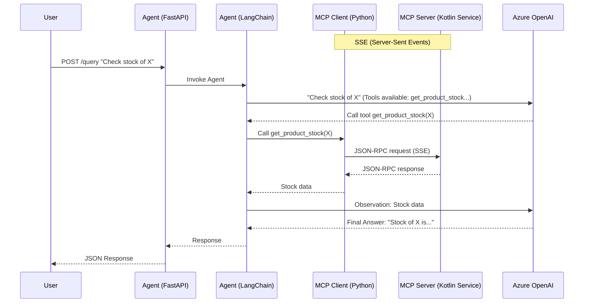

# Implementation Plan: AI Agent

This document outlines the design and implementation plan for the new AI Agent module.

## Goal
Create a standalone Python-based AI Agent that supports natural language queries to the ESO ERP system, utilizing the existing Kotlin MCP Server for data access.

## Architecture

The Agent will be a separate module (`agent/`) built with:
*   **Language**: Python 3.11+
*   **Web Framework**: FastAPI (exposing REST endpoints)
*   **Agent Framework**: LangChain (LangGraph)
*   **LLM Provider**: Azure OpenAI
*   **Data Access**: MCP Client (Python) connecting to a remote Kotlin MCP Server (SSE transport).
*   **Package Manager**: `uv`

### interactions


## Detailed Design

### 1. Project Structure
We will use **uv** for dependency management.

```
agent/
├── pyproject.toml       # Dependencies (fastapi, langchain, langgraph, mcp, openai, ...)
├── uv.lock
├── README.md
├── src/
│   ├── __init__.py
│   ├── main.py          # FastAPI entry point
│   ├── config.py        # Pydantic settings (Azure keys, MCP server URL)
│   ├── api/
│   │   ├── __init__.py
│   │   ├── models.py    # Request/Response models
│   │   └── routes.py    # Endpoint definitions
│   ├── core/
│   │   ├── __init__.py
│   │   ├── agent.py     # LangChain Agent graph definition
│   │   └── prompts.py   # System prompts
│   └── mcp_client/
│       ├── __init__.py
│       └── client_manager.py # Manages connection to Kotlin MCP Server (SSE)
└── Dockerfile           # Multi-stage build (Python only)
```

### 2. Configuration (`config.py`)
Using `pydantic-settings`:
*   `AZURE_OPENAI_API_KEY`
*   `AZURE_OPENAI_ENDPOINT`
*   `AZURE_OPENAI_DEPLOYMENT_NAME`
*   `MCP_SERVER_SSE_URL` (URL to the remote MCP Server SSE endpoint, e.g., `http://mcp-server:8080/sse`)

### 3. MCP Integration
*   The Python agent will act as an **MCP Client**.
*   It will connect to an existing running service via **SSE (Server-Sent Events)**.
*   No Java Runtime Environment (JRE) is needed in the Agent container.

### 4. Agent Logic
*   **Framework**: LangGraph (stateful, better control than legacy chains).
*   **Tools**: We will dynamically load tools from the MCP Client and bind them to the LangChain model.
*   **Flow**: Simple ReAct style (Reason + Act).

## User Review Required

> [!NOTE]
> **Azure Defaults**: Please confirm the specific Azure OpenAI model version (e.g., `gpt-4o` or `gpt-3.5-turbo`) to set as default.

## Proposed Changes

### [agent] New Module
#### [NEW] [agent/pyproject.toml](file:///Users/bora/Dev/eso-tools/agent/pyproject.toml)
Values for dependencies: `fastapi`, `uvicorn`, `langchain`, `langgraph`, `langchain-openai`, `mcp`, `pydantic-settings`. Managed by `uv`.

#### [NEW] [agent/src/config.py](file:///Users/bora/Dev/eso-tools/agent/src/config.py)
Configuration handling including `MCP_SERVER_SSE_URL`.

#### [NEW] [agent/src/mcp_client/client_manager.py](file:///Users/bora/Dev/eso-tools/agent/src/mcp_client/client_manager.py)
Logic to connect to the remote SSE endpoint and initialize the MCP Client session.

#### [NEW] [agent/src/core/agent.py](file:///Users/bora/Dev/eso-tools/agent/src/core/agent.py)
LangChain graph definition.

#### [NEW] [agent/src/api/routes.py](file:///Users/bora/Dev/eso-tools/agent/src/api/routes.py)
FastAPI endpoint `POST /query`.

#### [NEW] [tasks-agent-stage-1.md](file:///Users/bora/Dev/eso-tools/tasks-agent-stage-1.md)
Detailed task list for Phase 1.

## Phases

### Phase 1: Foundation & Scaffold
*   Initialize `uv` project.
*   Create basic FastAPI structure.
*   Implement simple "Echo" agent (no tools yet) to verify LLM connection.
*   **Deliverable**: Working FastAPI app answering basic questions (without ERP data).

### Phase 2: MCP Integration
*   Implement `MCPClientManager` to connect to the remote SSE endpoint.
*   Connect LangChain to MCP tools.
*   **Deliverable**: Agent can answer stock/order questions using the remote MCP service.

### Phase 3: Dockerization & End-to-End
*   Create Dockerfile (Python only).
*   Update `docker-compose.yml` to include the agent and link it to the MCP server service.
*   **Deliverable**: Fully running system in containers.

## Verification Plan

### Automated Tests
*   **Unit Tests**: `pytest` for Agent logic (mocking the MCP tool outputs).
*   **Integration Tests**: Run the Agent against a mock/real MCP SSE endpoint.

### Manual Verification
1.  **Run Agent**: `uv run start`
2.  **Test Query**:
    ```bash
    curl -X POST http://localhost:8000/query \
         -H "Content-Type: application/json" \
         -d '{"question": "What is the stock of Apple?"}'
    ```
